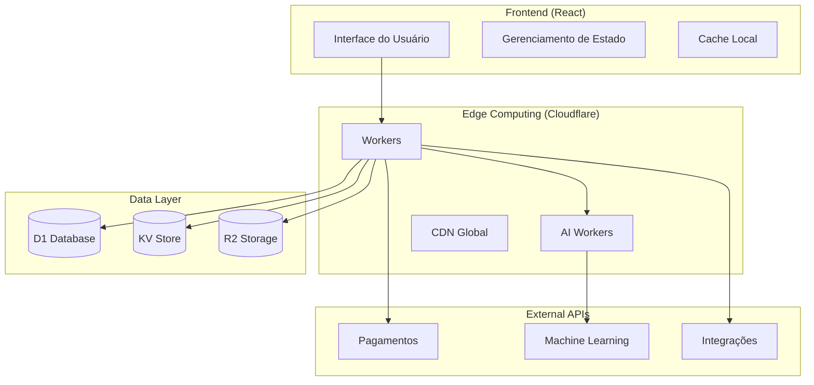

# 🔧 Especificação Técnica (SPEC) - NuvexPOS

**Versão:** 2.0.0  
**Data:** Janeiro 2025  
**Baseado em:** PRD v2.0.0  
**Equipe:** Desenvolvimento NuvexPOS  

---

## 📋 Índice

1. [Visão Geral Técnica](#-visão-geral-técnica)
2. [Arquitetura do Sistema](#-arquitetura-do-sistema)
3. [Especificações de Módulos](#-especificações-de-módulos)
4. [APIs e Integrações](#-apis-e-integrações)
5. [Banco de Dados](#-banco-de-dados)
6. [Recursos de IA](#-recursos-de-ia)
7. [Segurança e Performance](#-segurança-e-performance)
8. [Deployment e DevOps](#-deployment-e-devops)

---

## 🎯 Visão Geral Técnica

### Stack Tecnológico Detalhado

#### Frontend
```typescript
// Tecnologias principais
React: "18.3.1"
TypeScript: "5.5.3"
Vite: "5.4.1"
TailwindCSS: "3.4.11"
Shadcn/ui: "latest"

// Estado e Cache
TanStack Query: "5.56.2"
Zustand: "4.5.5" // Para estado global
React Hook Form: "7.53.0"
Zod: "3.23.8"

// UI Avançada
React Flow: "11.11.4" // Para diagramas
Aceternity UI: "latest" // Componentes avançados
Magic UI: "latest" // Animações
Recharts: "2.12.7" // Gráficos
```

#### Backend/Infraestrutura
```typescript
// Cloudflare Stack
Workers: "latest"
D1: "SQLite distribuído"
KV: "Key-Value store"
R2: "Object storage"
AI Workers: "LLM e ML"

// Ferramentas
Wrangler: "3.78.12"
Hono: "4.6.3" // Framework para Workers
Drizzle ORM: "0.33.0" // ORM para D1
```

### Padrões de Arquitetura

#### Design Patterns
- **Repository Pattern**: Para abstração de dados
- **Factory Pattern**: Para criação de serviços
- **Observer Pattern**: Para eventos em tempo real
- **Strategy Pattern**: Para algoritmos de IA
- **Singleton Pattern**: Para configurações globais

#### Princípios SOLID
- **Single Responsibility**: Cada módulo tem uma responsabilidade
- **Open/Closed**: Extensível sem modificação
- **Liskov Substitution**: Interfaces bem definidas
- **Interface Segregation**: Interfaces específicas
- **Dependency Inversion**: Dependências abstratas

---

## 🏗️ Arquitetura do Sistema

### Diagrama de Arquitetura


### Fluxo de Dados
```typescript
// Fluxo típico de uma operação
interface DataFlow {
  request: {
    origin: 'UI Component';
    middleware: ['Auth', 'Validation', 'Rate Limiting'];
    destination: 'Cloudflare Worker';
  };
  processing: {
    worker: 'Business Logic';
    ai: 'ML Processing (se necessário)';
    database: 'D1 Operations';
    cache: 'KV Store';
  };
  response: {
    format: 'JSON API';
    cache: 'Edge Cache';
    delivery: 'Global CDN';
  };
}
```

---

## 📦 Especificações de Módulos

### 1. Dashboard Inteligente

#### Estrutura de Arquivos
```
src/pages/Dashboard/
├── index.tsx                 # Página principal
├── components/
│   ├── MetricsCards.tsx     # Cards de métricas
│   ├── SalesChart.tsx       # Gráfico de vendas
│   ├── AIInsights.tsx       # Insights de IA
│   └── QuickActions.tsx     # Ações rápidas
├── hooks/
│   ├── useDashboardData.ts  # Hook para dados
│   └── useRealTimeUpdates.ts # Updates em tempo real
└── types/
    └── dashboard.types.ts    # Tipos TypeScript
```

#### Interfaces TypeScript
```typescript
// types/dashboard.types.ts
export interface DashboardMetrics {
  sales: {
    today: number;
    yesterday: number;
    growth: number;
    target: number;
  };
  inventory: {
    totalProducts: number;
    lowStock: number;
    outOfStock: number;
    turnoverRate: number;
  };
  customers: {
    total: number;
    new: number;
    returning: number;
    satisfaction: number;
  };
  ai: {
    predictions: AIprediction[];
    alerts: AIAlert[];
    recommendations: AIRecommendation[];
  };
}

export interface AIInsight {
  id: string;
  type: 'prediction' | 'alert' | 'recommendation';
  title: string;
  description: string;
  confidence: number;
  impact: 'low' | 'medium' | 'high';
  actionable: boolean;
  createdAt: Date;
}
```

#### Componente Principal
```typescript
// pages/Dashboard/index.tsx
import { FC } from 'react';
import { useDashboardData } from './hooks/useDashboardData';
import { useRealTimeUpdates } from './hooks/useRealTimeUpdates';
import { MetricsCards } from './components/MetricsCards';
import { SalesChart } from './components/SalesChart';
import { AIInsights } from './components/AIInsights';

export const Dashboard: FC = () => {
  const { data, isLoading, error } = useDashboardData();
  const { isConnected } = useRealTimeUpdates();

  if (isLoading) return <DashboardSkeleton />;
  if (error) return <ErrorBoundary error={error} />;

  return (
    <div className="dashboard-container">
      <DashboardHeader isConnected={isConnected} />
      <MetricsCards metrics={data.metrics} />
      <div className="grid grid-cols-1 lg:grid-cols-2 gap-6">
        <SalesChart data={data.sales} />
        <AIInsights insights={data.ai.insights} />
      </div>
    </div>
  );
};
```

### 2. PDV (Ponto de Venda) Avançado

#### Estrutura de Arquivos
```
src/pages/POS/
├── index.tsx                 # Interface principal do PDV
├── components/
│   ├── ProductSearch.tsx    # Busca de produtos
│   ├── CartManager.tsx      # Gerenciamento do carrinho
│   ├── PaymentProcessor.tsx # Processamento de pagamentos
│   ├── BarcodeScanner.tsx   # Scanner de código de barras
│   └── VoiceSearch.tsx      # Busca por voz
├── hooks/
│   ├── useCart.ts           # Lógica do carrinho
│   ├── usePayment.ts        # Processamento de pagamentos
│   └── useVoiceCommands.ts  # Comandos de voz
└── services/
    ├── posService.ts        # Serviços do PDV
    └── paymentService.ts    # Serviços de pagamento
```

#### Interface do Carrinho
```typescript
// hooks/useCart.ts
export interface CartItem {
  id: string;
  productId: string;
  name: string;
  price: number;
  quantity: number;
  discount?: number;
  tax?: number;
  metadata?: Record<string, any>;
}

export interface Cart {
  id: string;
  items: CartItem[];
  subtotal: number;
  tax: number;
  discount: number;
  total: number;
  customer?: Customer;
  createdAt: Date;
  updatedAt: Date;
}

export const useCart = () => {
  const [cart, setCart] = useState<Cart>(createEmptyCart());

  const addItem = useCallback((product: Product, quantity = 1) => {
    setCart(prev => ({
      ...prev,
      items: addItemToCart(prev.items, product, quantity),
      updatedAt: new Date()
    }));
  }, []);

  const removeItem = useCallback((itemId: string) => {
    setCart(prev => ({
      ...prev,
      items: prev.items.filter(item => item.id !== itemId),
      updatedAt: new Date()
    }));
  }, []);

  const updateQuantity = useCallback((itemId: string, quantity: number) => {
    setCart(prev => ({
      ...prev,
      items: prev.items.map(item => 
        item.id === itemId ? { ...item, quantity } : item
      ),
      updatedAt: new Date()
    }));
  }, []);

  return {
    cart,
    addItem,
    removeItem,
    updateQuantity,
    clearCart: () => setCart(createEmptyCart()),
    calculateTotals: () => calculateCartTotals(cart)
  };
};
```

### 3. Gestão Inteligente de Estoque

#### Estrutura de Arquivos
```
src/pages/Inventory/
├── index.tsx                    # Página principal
├── components/
│   ├── ProductList.tsx         # Lista de produtos
│   ├── StockAlerts.tsx         # Alertas de estoque
│   ├── PredictionChart.tsx     # Gráfico de previsões
│   ├── ABCAnalysis.tsx         # Análise ABC
│   └── SmartRecommendations.tsx # Recomendações de IA
├── hooks/
│   ├── useInventory.ts         # Dados de estoque
│   ├── usePredictions.ts       # Previsões de IA
│   └── useStockAlerts.ts       # Alertas inteligentes
└── services/
    ├── inventoryService.ts     # Serviços de estoque
    └── aiPredictionService.ts  # Serviços de IA
```

#### Serviço de Previsões de IA
```typescript
// services/aiPredictionService.ts
export interface StockPrediction {
  productId: string;
  currentStock: number;
  predictedDemand: number;
  recommendedOrder: number;
  confidence: number;
  timeframe: 'daily' | 'weekly' | 'monthly';
  factors: PredictionFactor[];
}

export interface PredictionFactor {
  name: string;
  impact: number;
  description: string;
}

export class AIPredictionService {
  private aiWorker: CloudflareAI;

  constructor() {
    this.aiWorker = new CloudflareAI({
      model: '@cf/meta/llama-3.1-8b-instruct'
    });
  }

  async predictDemand(
    productId: string,
    historicalData: SalesData[],
    externalFactors: ExternalFactor[]
  ): Promise<StockPrediction> {
    const prompt = this.buildPredictionPrompt(
      productId,
      historicalData,
      externalFactors
    );

    const response = await this.aiWorker.run(prompt);
    return this.parsePredictionResponse(response);
  }

  private buildPredictionPrompt(
    productId: string,
    historicalData: SalesData[],
    externalFactors: ExternalFactor[]
  ): string {
    return `
      Analise os dados históricos de vendas e fatores externos para prever a demanda:
      
      Produto ID: ${productId}
      Dados históricos: ${JSON.stringify(historicalData)}
      Fatores externos: ${JSON.stringify(externalFactors)}
      
      Forneça uma previsão estruturada com:
      - Demanda prevista
      - Nível de confiança
      - Fatores de impacto
      - Recomendação de pedido
    `;
  }
}
```

---

## 🔌 APIs e Integrações

### API REST Specification

#### Endpoints Principais
```typescript
// API Routes Structure
const API_ROUTES = {
  // Autenticação
  auth: {
    login: 'POST /api/v1/auth/login',
    logout: 'POST /api/v1/auth/logout',
    refresh: 'POST /api/v1/auth/refresh',
    profile: 'GET /api/v1/auth/profile'
  },

  // Produtos
  products: {
    list: 'GET /api/v1/products',
    create: 'POST /api/v1/products',
    get: 'GET /api/v1/products/:id',
    update: 'PUT /api/v1/products/:id',
    delete: 'DELETE /api/v1/products/:id',
    search: 'GET /api/v1/products/search'
  },

  // Vendas
  sales: {
    list: 'GET /api/v1/sales',
    create: 'POST /api/v1/sales',
    get: 'GET /api/v1/sales/:id',
    process: 'POST /api/v1/sales/:id/process',
    cancel: 'POST /api/v1/sales/:id/cancel'
  },

  // IA e Analytics
  ai: {
    predictions: 'GET /api/v1/ai/predictions',
    insights: 'GET /api/v1/ai/insights',
    recommendations: 'GET /api/v1/ai/recommendations',
    analyze: 'POST /api/v1/ai/analyze'
  }
} as const;
```

#### Middleware Stack
```typescript
// src/worker/middleware/index.ts
export const middlewareStack = [
  corsMiddleware,
  authMiddleware,
  rateLimitMiddleware,
  validationMiddleware,
  loggingMiddleware,
  errorHandlingMiddleware
];

// Exemplo de middleware de autenticação
export const authMiddleware = async (
  request: Request,
  env: Env,
  ctx: ExecutionContext
) => {
  const token = request.headers.get('Authorization')?.replace('Bearer ', '');
  
  if (!token) {
    return new Response('Unauthorized', { status: 401 });
  }

  try {
    const payload = await verifyJWT(token, env.JWT_SECRET);
    request.user = payload;
    return null; // Continue to next middleware
  } catch (error) {
    return new Response('Invalid token', { status: 401 });
  }
};
```

### Integrações Externas

#### Pagamentos
```typescript
// services/paymentService.ts
export interface PaymentProvider {
  name: string;
  process(payment: PaymentRequest): Promise<PaymentResult>;
  refund(transactionId: string): Promise<RefundResult>;
  webhook(data: any): Promise<WebhookResult>;
}

export class StripeProvider implements PaymentProvider {
  name = 'stripe';

  async process(payment: PaymentRequest): Promise<PaymentResult> {
    const stripe = new Stripe(env.STRIPE_SECRET_KEY);
    
    const paymentIntent = await stripe.paymentIntents.create({
      amount: payment.amount,
      currency: payment.currency,
      metadata: payment.metadata
    });

    return {
      success: true,
      transactionId: paymentIntent.id,
      status: paymentIntent.status
    };
  }
}

export class PaymentService {
  private providers: Map<string, PaymentProvider> = new Map();

  constructor() {
    this.providers.set('stripe', new StripeProvider());
    this.providers.set('mercadopago', new MercadoPagoProvider());
    this.providers.set('pix', new PixProvider());
  }

  async processPayment(
    provider: string,
    payment: PaymentRequest
  ): Promise<PaymentResult> {
    const paymentProvider = this.providers.get(provider);
    if (!paymentProvider) {
      throw new Error(`Provider ${provider} not found`);
    }

    return await paymentProvider.process(payment);
  }
}
```

---

## 🗄️ Banco de Dados

### Schema D1 (SQLite)
```sql
-- Empresas e Lojas
CREATE TABLE companies (
  id TEXT PRIMARY KEY,
  name TEXT NOT NULL,
  email TEXT UNIQUE NOT NULL,
  settings JSON DEFAULT '{}',
  created_at DATETIME DEFAULT CURRENT_TIMESTAMP,
  updated_at DATETIME DEFAULT CURRENT_TIMESTAMP
);

CREATE TABLE stores (
  id TEXT PRIMARY KEY,
  company_id TEXT NOT NULL,
  name TEXT NOT NULL,
  address TEXT,
  settings JSON DEFAULT '{}',
  created_at DATETIME DEFAULT CURRENT_TIMESTAMP,
  FOREIGN KEY (company_id) REFERENCES companies(id)
);

-- Produtos e Categorias
CREATE TABLE categories (
  id TEXT PRIMARY KEY,
  store_id TEXT NOT NULL,
  name TEXT NOT NULL,
  description TEXT,
  parent_id TEXT,
  created_at DATETIME DEFAULT CURRENT_TIMESTAMP,
  FOREIGN KEY (store_id) REFERENCES stores(id),
  FOREIGN KEY (parent_id) REFERENCES categories(id)
);

CREATE TABLE products (
  id TEXT PRIMARY KEY,
  store_id TEXT NOT NULL,
  category_id TEXT,
  name TEXT NOT NULL,
  description TEXT,
  sku TEXT UNIQUE,
  barcode TEXT,
  price DECIMAL(10,2) NOT NULL,
  cost DECIMAL(10,2),
  weight DECIMAL(8,3),
  dimensions JSON,
  images JSON DEFAULT '[]',
  metadata JSON DEFAULT '{}',
  active BOOLEAN DEFAULT TRUE,
  created_at DATETIME DEFAULT CURRENT_TIMESTAMP,
  updated_at DATETIME DEFAULT CURRENT_TIMESTAMP,
  FOREIGN KEY (store_id) REFERENCES stores(id),
  FOREIGN KEY (category_id) REFERENCES categories(id)
);

-- Estoque
CREATE TABLE inventory (
  id TEXT PRIMARY KEY,
  product_id TEXT NOT NULL,
  store_id TEXT NOT NULL,
  quantity INTEGER NOT NULL DEFAULT 0,
  min_stock INTEGER DEFAULT 0,
  max_stock INTEGER,
  location TEXT,
  batch_number TEXT,
  expiry_date DATE,
  last_updated DATETIME DEFAULT CURRENT_TIMESTAMP,
  FOREIGN KEY (product_id) REFERENCES products(id),
  FOREIGN KEY (store_id) REFERENCES stores(id)
);

-- Vendas
CREATE TABLE sales (
  id TEXT PRIMARY KEY,
  store_id TEXT NOT NULL,
  user_id TEXT NOT NULL,
  customer_id TEXT,
  total DECIMAL(10,2) NOT NULL,
  subtotal DECIMAL(10,2) NOT NULL,
  tax DECIMAL(10,2) DEFAULT 0,
  discount DECIMAL(10,2) DEFAULT 0,
  status TEXT DEFAULT 'pending',
  payment_method TEXT,
  payment_status TEXT DEFAULT 'pending',
  notes TEXT,
  metadata JSON DEFAULT '{}',
  created_at DATETIME DEFAULT CURRENT_TIMESTAMP,
  completed_at DATETIME,
  FOREIGN KEY (store_id) REFERENCES stores(id),
  FOREIGN KEY (user_id) REFERENCES users(id),
  FOREIGN KEY (customer_id) REFERENCES customers(id)
);

CREATE TABLE sale_items (
  id TEXT PRIMARY KEY,
  sale_id TEXT NOT NULL,
  product_id TEXT NOT NULL,
  quantity INTEGER NOT NULL,
  unit_price DECIMAL(10,2) NOT NULL,
  total_price DECIMAL(10,2) NOT NULL,
  discount DECIMAL(10,2) DEFAULT 0,
  metadata JSON DEFAULT '{}',
  FOREIGN KEY (sale_id) REFERENCES sales(id),
  FOREIGN KEY (product_id) REFERENCES products(id)
);

-- IA e Analytics
CREATE TABLE ai_predictions (
  id TEXT PRIMARY KEY,
  store_id TEXT NOT NULL,
  product_id TEXT,
  type TEXT NOT NULL, -- 'demand', 'stock', 'price'
  prediction JSON NOT NULL,
  confidence DECIMAL(3,2),
  factors JSON DEFAULT '[]',
  created_at DATETIME DEFAULT CURRENT_TIMESTAMP,
  valid_until DATETIME,
  FOREIGN KEY (store_id) REFERENCES stores(id),
  FOREIGN KEY (product_id) REFERENCES products(id)
);

CREATE TABLE ai_insights (
  id TEXT PRIMARY KEY,
  store_id TEXT NOT NULL,
  type TEXT NOT NULL,
  title TEXT NOT NULL,
  description TEXT,
  data JSON DEFAULT '{}',
  priority TEXT DEFAULT 'medium',
  status TEXT DEFAULT 'active',
  created_at DATETIME DEFAULT CURRENT_TIMESTAMP,
  expires_at DATETIME,
  FOREIGN KEY (store_id) REFERENCES stores(id)
);
```

### Índices para Performance
```sql
-- Índices para otimização de queries
CREATE INDEX idx_products_store_id ON products(store_id);
CREATE INDEX idx_products_category_id ON products(category_id);
CREATE INDEX idx_products_sku ON products(sku);
CREATE INDEX idx_products_barcode ON products(barcode);

CREATE INDEX idx_inventory_product_id ON inventory(product_id);
CREATE INDEX idx_inventory_store_id ON inventory(store_id);

CREATE INDEX idx_sales_store_id ON sales(store_id);
CREATE INDEX idx_sales_created_at ON sales(created_at);
CREATE INDEX idx_sales_status ON sales(status);

CREATE INDEX idx_sale_items_sale_id ON sale_items(sale_id);
CREATE INDEX idx_sale_items_product_id ON sale_items(product_id);

CREATE INDEX idx_ai_predictions_store_id ON ai_predictions(store_id);
CREATE INDEX idx_ai_predictions_type ON ai_predictions(type);
CREATE INDEX idx_ai_predictions_created_at ON ai_predictions(created_at);
```

---

## 🤖 Recursos de IA

### 1. AI Store Manager

#### Arquitetura do Serviço
```typescript
// services/aiStoreManager.ts
export class AIStoreManager {
  private llm: CloudflareLLM;
  private analytics: AnalyticsService;
  private insights: InsightsService;

  constructor(env: Env) {
    this.llm = new CloudflareLLM({
      model: '@cf/meta/llama-3.1-8b-instruct',
      apiToken: env.CLOUDFLARE_AI_TOKEN
    });
  }

  async generateDailyReport(storeId: string): Promise<DailyReport> {
    const data = await this.analytics.getDailyData(storeId);
    
    const prompt = `
      Analise os dados de vendas do dia e gere um relatório executivo:
      
      Vendas: ${JSON.stringify(data.sales)}
      Estoque: ${JSON.stringify(data.inventory)}
      Clientes: ${JSON.stringify(data.customers)}
      
      Forneça:
      1. Resumo executivo
      2. Principais insights
      3. Alertas importantes
      4. Recomendações de ação
      5. Previsões para amanhã
    `;

    const response = await this.llm.generate(prompt);
    return this.parseReport(response);
  }

  async detectAnomalies(storeId: string): Promise<Anomaly[]> {
    const historicalData = await this.analytics.getHistoricalData(storeId, 30);
    const todayData = await this.analytics.getTodayData(storeId);

    const anomalies: Anomaly[] = [];

    // Detecção de anomalias em vendas
    if (this.isAnomalousValue(todayData.sales, historicalData.sales)) {
      anomalies.push({
        type: 'sales',
        severity: 'high',
        description: 'Vendas significativamente diferentes do padrão',
        recommendation: 'Investigar causas e ajustar estratégia'
      });
    }

    return anomalies;
  }
}
```

### 2. Computer Vision para Produtos

#### Serviço de Reconhecimento Visual
```typescript
// services/computerVisionService.ts
export class ComputerVisionService {
  private visionModel: CloudflareVision;

  constructor(env: Env) {
    this.visionModel = new CloudflareVision({
      model: '@cf/microsoft/resnet-50',
      apiToken: env.CLOUDFLARE_AI_TOKEN
    });
  }

  async recognizeProduct(imageData: ArrayBuffer): Promise<ProductRecognition> {
    const result = await this.visionModel.classify(imageData);
    
    return {
      productId: result.productId,
      confidence: result.confidence,
      boundingBox: result.boundingBox,
      attributes: result.attributes,
      suggestions: await this.getSimilarProducts(result.features)
    };
  }

  async analyzeShelfLayout(imageData: ArrayBuffer): Promise<ShelfAnalysis> {
    const objects = await this.visionModel.detectObjects(imageData);
    
    return {
      products: objects.filter(obj => obj.type === 'product'),
      emptySpaces: this.detectEmptySpaces(objects),
      organization: this.analyzeOrganization(objects),
      recommendations: this.generateLayoutRecommendations(objects)
    };
  }

  async validateProductPlacement(
    imageData: ArrayBuffer,
    expectedLayout: ShelfLayout
  ): Promise<ValidationResult> {
    const currentLayout = await this.analyzeShelfLayout(imageData);
    
    return {
      isValid: this.compareLayouts(currentLayout, expectedLayout),
      discrepancies: this.findDiscrepancies(currentLayout, expectedLayout),
      score: this.calculateComplianceScore(currentLayout, expectedLayout)
    };
  }
}
```

### 3. NLP para Atendimento

#### Processamento de Linguagem Natural
```typescript
// services/nlpService.ts
export class NLPService {
  private nlpModel: CloudflareNLP;

  constructor(env: Env) {
    this.nlpModel = new CloudflareNLP({
      model: '@cf/meta/llama-3.1-8b-instruct',
      apiToken: env.CLOUDFLARE_AI_TOKEN
    });
  }

  async processCustomerQuery(query: string): Promise<QueryResponse> {
    const intent = await this.classifyIntent(query);
    const entities = await this.extractEntities(query);
    
    switch (intent.type) {
      case 'product_search':
        return await this.handleProductSearch(entities);
      case 'price_inquiry':
        return await this.handlePriceInquiry(entities);
      case 'availability_check':
        return await this.handleAvailabilityCheck(entities);
      case 'complaint':
        return await this.handleComplaint(query, entities);
      default:
        return await this.generateGenericResponse(query);
    }
  }

  async analyzeSentiment(text: string): Promise<SentimentAnalysis> {
    const result = await this.nlpModel.analyzeSentiment(text);
    
    return {
      sentiment: result.sentiment, // 'positive', 'negative', 'neutral'
      confidence: result.confidence,
      emotions: result.emotions,
      keywords: result.keywords,
      urgency: this.calculateUrgency(result)
    };
  }

  async generateResponse(
    context: ConversationContext,
    userMessage: string
  ): Promise<string> {
    const prompt = `
      Contexto da conversa: ${JSON.stringify(context)}
      Mensagem do usuário: ${userMessage}
      
      Gere uma resposta útil, profissional e contextualizada.
      Mantenha o tom amigável e ofereça soluções práticas.
    `;

    const response = await this.nlpModel.generate(prompt);
    return this.sanitizeResponse(response);
  }
}
```

---

## 🔒 Segurança e Performance

### Configurações de Segurança

#### Headers de Segurança
```typescript
// middleware/securityHeaders.ts
export const securityHeaders = {
  'X-Frame-Options': 'DENY',
  'X-Content-Type-Options': 'nosniff',
  'X-XSS-Protection': '1; mode=block',
  'Strict-Transport-Security': 'max-age=31536000; includeSubDomains',
  'Content-Security-Policy': `
    default-src 'self';
    script-src 'self' 'unsafe-inline' https://js.stripe.com;
    style-src 'self' 'unsafe-inline' https://fonts.googleapis.com;
    font-src 'self' https://fonts.gstatic.com;
    img-src 'self' data: https:;
    connect-src 'self' https://api.stripe.com https://api.mercadopago.com;
  `.replace(/\s+/g, ' ').trim(),
  'Referrer-Policy': 'strict-origin-when-cross-origin',
  'Permissions-Policy': 'camera=(), microphone=(), geolocation=()'
};
```

#### Autenticação JWT
```typescript
// services/authService.ts
export class AuthService {
  private jwtSecret: string;

  constructor(env: Env) {
    this.jwtSecret = env.JWT_SECRET;
  }

  async generateToken(user: User): Promise<string> {
    const payload = {
      userId: user.id,
      email: user.email,
      role: user.role,
      storeId: user.storeId,
      permissions: user.permissions,
      iat: Math.floor(Date.now() / 1000),
      exp: Math.floor(Date.now() / 1000) + (24 * 60 * 60) // 24 horas
    };

    return await this.signJWT(payload, this.jwtSecret);
  }

  async verifyToken(token: string): Promise<JWTPayload> {
    try {
      return await this.verifyJWT(token, this.jwtSecret);
    } catch (error) {
      throw new Error('Invalid or expired token');
    }
  }

  async refreshToken(refreshToken: string): Promise<string> {
    const payload = await this.verifyToken(refreshToken);
    const user = await this.getUserById(payload.userId);
    
    if (!user || !user.active) {
      throw new Error('User not found or inactive');
    }

    return await this.generateToken(user);
  }
}
```

### Otimizações de Performance

#### Cache Strategy
```typescript
// services/cacheService.ts
export class CacheService {
  private kv: KVNamespace;

  constructor(env: Env) {
    this.kv = env.CACHE_KV;
  }

  async get<T>(key: string): Promise<T | null> {
    const cached = await this.kv.get(key, 'json');
    return cached as T | null;
  }

  async set<T>(
    key: string,
    value: T,
    ttl: number = 3600
  ): Promise<void> {
    await this.kv.put(key, JSON.stringify(value), {
      expirationTtl: ttl
    });
  }

  async invalidate(pattern: string): Promise<void> {
    const keys = await this.kv.list({ prefix: pattern });
    const deletePromises = keys.keys.map(key => 
      this.kv.delete(key.name)
    );
    await Promise.all(deletePromises);
  }

  // Cache específico para dados de produtos
  async cacheProduct(product: Product): Promise<void> {
    const key = `product:${product.id}`;
    await this.set(key, product, 3600); // 1 hora
  }

  // Cache para resultados de busca
  async cacheSearchResults(
    query: string,
    results: Product[],
    ttl: number = 300 // 5 minutos
  ): Promise<void> {
    const key = `search:${this.hashQuery(query)}`;
    await this.set(key, results, ttl);
  }
}
```

---

## 🚀 Deployment e DevOps

### Configuração do Wrangler
```toml
# wrangler.toml
name = "nuvexpos"
main = "src/worker/index.ts"
compatibility_date = "2024-01-01"
compatibility_flags = ["nodejs_compat"]

[site]
bucket = "./dist"

[build]
command = "npm run build"

# Variáveis de ambiente para desenvolvimento
[env.development.vars]
ENVIRONMENT = "development"
LOG_LEVEL = "debug"

# Configuração para staging
[env.staging]
name = "nuvexpos-staging"
route = "staging.nuvexpos.com/*"

[env.staging.vars]
ENVIRONMENT = "staging"
LOG_LEVEL = "info"

# Configuração para produção
[env.production]
name = "nuvexpos-production"
route = "app.nuvexpos.com/*"

[env.production.vars]
ENVIRONMENT = "production"
LOG_LEVEL = "warn"

# Configuração do D1
[[d1_databases]]
binding = "DB"
database_name = "nuvexpos-db"
database_id = "your-database-id"

# Configuração do KV
[[kv_namespaces]]
binding = "CACHE_KV"
id = "your-cache-kv-id"

[[kv_namespaces]]
binding = "SESSION_KV"
id = "your-session-kv-id"

# Configuração do R2
[[r2_buckets]]
binding = "ASSETS"
bucket_name = "nuvexpos-assets"

# Configuração de AI
[ai]
binding = "AI"
```

### Scripts de Deploy
```json
{
  "scripts": {
    "dev": "wrangler dev",
    "build": "vite build",
    "build:worker": "wrangler deploy --dry-run",
    "deploy:staging": "wrangler deploy --env staging",
    "deploy:production": "wrangler deploy --env production",
    "db:migrate": "wrangler d1 migrations apply nuvexpos-db",
    "db:seed": "wrangler d1 execute nuvexpos-db --file ./scripts/seed.sql",
    "test": "jest",
    "test:e2e": "playwright test",
    "lint": "eslint . --ext .ts,.tsx",
    "type-check": "tsc --noEmit"
  }
}
```

### CI/CD Pipeline
```yaml
# .github/workflows/deploy.yml
name: Deploy to Cloudflare

on:
  push:
    branches: [main, staging]
  pull_request:
    branches: [main]

jobs:
  test:
    runs-on: ubuntu-latest
    steps:
      - uses: actions/checkout@v4
      - uses: actions/setup-node@v4
        with:
          node-version: '20'
          cache: 'npm'
      
      - run: npm ci
      - run: npm run lint
      - run: npm run type-check
      - run: npm run test
      - run: npm run build

  deploy-staging:
    if: github.ref == 'refs/heads/staging'
    needs: test
    runs-on: ubuntu-latest
    steps:
      - uses: actions/checkout@v4
      - uses: actions/setup-node@v4
        with:
          node-version: '20'
          cache: 'npm'
      
      - run: npm ci
      - run: npm run build
      
      - name: Deploy to Staging
        uses: cloudflare/wrangler-action@v3
        with:
          apiToken: ${{ secrets.CLOUDFLARE_API_TOKEN }}
          environment: staging

  deploy-production:
    if: github.ref == 'refs/heads/main'
    needs: test
    runs-on: ubuntu-latest
    steps:
      - uses: actions/checkout@v4
      - uses: actions/setup-node@v4
        with:
          node-version: '20'
          cache: 'npm'
      
      - run: npm ci
      - run: npm run build
      
      - name: Deploy to Production
        uses: cloudflare/wrangler-action@v3
        with:
          apiToken: ${{ secrets.CLOUDFLARE_API_TOKEN }}
          environment: production
```

---

## 📊 Monitoramento e Observabilidade

### Métricas e Logs
```typescript
// services/monitoringService.ts
export class MonitoringService {
  private analytics: AnalyticsEngine;

  constructor(env: Env) {
    this.analytics = env.ANALYTICS;
  }

  async trackEvent(event: AnalyticsEvent): Promise<void> {
    await this.analytics.writeDataPoint({
      blobs: [event.name, event.userId, event.storeId],
      doubles: [event.value, event.timestamp],
      indexes: [event.category]
    });
  }

  async trackPerformance(metric: PerformanceMetric): Promise<void> {
    await this.analytics.writeDataPoint({
      blobs: ['performance', metric.endpoint, metric.method],
      doubles: [metric.duration, metric.timestamp],
      indexes: [metric.status.toString()]
    });
  }

  async trackError(error: ErrorEvent): Promise<void> {
    await this.analytics.writeDataPoint({
      blobs: ['error', error.message, error.stack],
      doubles: [error.timestamp],
      indexes: [error.severity]
    });
  }
}
```

---

## 🔄 Próximos Passos

### Implementação Prioritária
1. **Configurar estrutura base do projeto**
2. **Implementar autenticação e autorização**
3. **Criar APIs fundamentais (produtos, vendas)**
4. **Desenvolver interface do PDV**
5. **Integrar serviços de IA básicos**
6. **Implementar sistema de cache**
7. **Configurar monitoramento**
8. **Testes e deploy**

### Cronograma Técnico
- **Semana 1-2**: Setup e autenticação
- **Semana 3-4**: APIs core e banco de dados
- **Semana 5-6**: Interface PDV e dashboard
- **Semana 7-8**: Integração de IA básica
- **Semana 9-10**: Otimizações e testes
- **Semana 11-12**: Deploy e monitoramento

---

*Documento técnico confidencial - NuvexPOS Development Team*