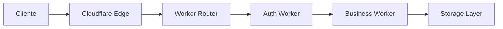
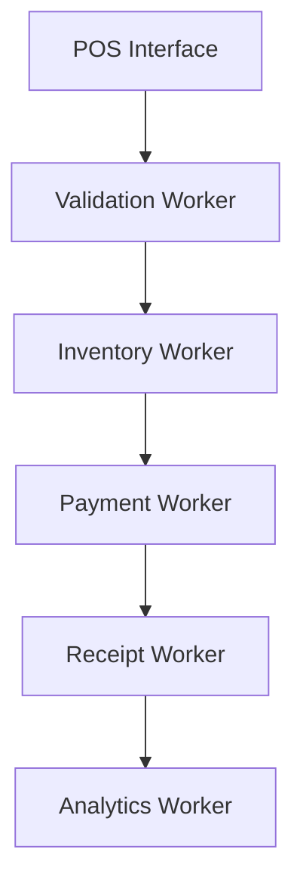
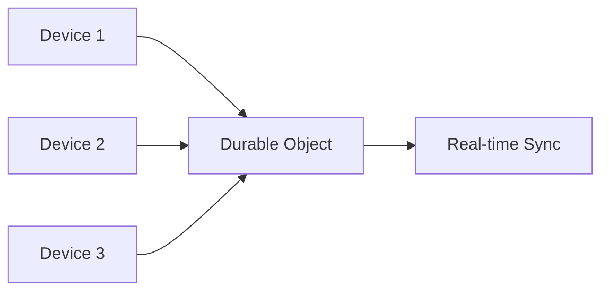

# 🏗️ Arquitetura do Sistema NuvexPOS

## Visão Geral

O NuvexPOS é construído com uma arquitetura serverless moderna, utilizando Cloudflare Workers como backbone principal. Esta abordagem garante alta disponibilidade, escalabilidade automática e baixa latência global.

## 🎯 Princípios Arquiteturais

### 1. Serverless First
- **Zero Infraestrutura**: Sem servidores para gerenciar
- **Auto-scaling**: Escala automaticamente com a demanda
- **Pay-per-use**: Custos baseados apenas no uso real

### 2. Edge Computing
- **Global Distribution**: Código executado próximo aos usuários
- **Baixa Latência**: Resposta em milissegundos
- **Alta Disponibilidade**: 99.9% de uptime garantido

### 3. Security by Design
- **Zero Trust**: Verificação em cada requisição
- **Encryption**: Dados criptografados em trânsito e repouso
- **Isolation**: Isolamento completo entre tenants

## 🏛️ Componentes da Arquitetura

### Frontend (React SPA)
```
┌─────────────────────────────────────┐
│           React Frontend            │
├─────────────────────────────────────┤
│ • React 18 + TypeScript             │
│ • Vite (Build Tool)                 │
│ • Tailwind CSS + Shadcn/ui          │
│ • React Query (State Management)    │
│ • React Router (Navigation)         │
└─────────────────────────────────────┘
```

### Backend (Cloudflare Workers)
```
┌─────────────────────────────────────┐
│        Cloudflare Workers           │
├─────────────────────────────────────┤
│ • API Gateway Worker                │
│ • Authentication Worker             │
│ • Business Logic Workers            │
│ • Webhook Handler Worker            │
│ • AI Processing Worker              │
│ • Cache Manager Worker              │
└─────────────────────────────────────┘
```

### Armazenamento
```
┌─────────────────────────────────────┐
│       Cloudflare Storage            │
├─────────────────────────────────────┤
│ • KV Store (Cache & Sessions)       │
│ • D1 Database (Relational Data)     │
│ • R2 Storage (Files & Images)       │
│ • Durable Objects (Real-time)       │
└─────────────────────────────────────┘
```

## 🔄 Fluxo de Dados

### 1. Requisição do Cliente


### 2. Processamento de Vendas


### 3. Sincronização Multi-dispositivo


## 🗄️ Modelo de Dados

### Estrutura Principal
```sql
-- Empresas e Filiais
Companies (id, name, settings, created_at)
Stores (id, company_id, name, address, settings)

-- Produtos e Estoque
Products (id, store_id, name, price, category_id)
Inventory (id, product_id, quantity, min_stock)
Categories (id, name, description)

-- Vendas e Transações
Sales (id, store_id, user_id, total, status, created_at)
SaleItems (id, sale_id, product_id, quantity, price)
Payments (id, sale_id, method, amount, status)

-- Usuários e Permissões
Users (id, company_id, email, role, permissions)
Sessions (id, user_id, token, expires_at)
```

### Relacionamentos
```
Company 1:N Store 1:N Product
Product 1:1 Inventory
Product N:1 Category
Store 1:N Sale 1:N SaleItem
Sale 1:N Payment
Company 1:N User
```

## 🔐 Segurança

### Autenticação e Autorização
- **JWT Tokens**: Tokens seguros com expiração
- **Role-based Access**: Controle granular de permissões
- **Multi-factor Auth**: Autenticação em duas etapas
- **Session Management**: Gerenciamento seguro de sessões

### Proteção de Dados
- **Encryption at Rest**: Dados criptografados no armazenamento
- **Encryption in Transit**: HTTPS/TLS em todas as comunicações
- **Data Isolation**: Isolamento completo entre tenants
- **Audit Logs**: Logs completos de todas as ações

### Compliance
- **LGPD**: Conformidade com a Lei Geral de Proteção de Dados
- **PCI DSS**: Padrões de segurança para pagamentos
- **SOC 2**: Controles de segurança organizacional

## 🚀 Performance

### Otimizações Frontend
- **Code Splitting**: Carregamento sob demanda
- **Tree Shaking**: Remoção de código não utilizado
- **Image Optimization**: Compressão e lazy loading
- **Service Workers**: Cache inteligente offline

### Otimizações Backend
- **Edge Caching**: Cache distribuído globalmente
- **Database Optimization**: Queries otimizadas e indexação
- **Connection Pooling**: Reutilização de conexões
- **Compression**: Compressão de respostas

### Métricas de Performance
- **First Contentful Paint**: < 1.5s
- **Largest Contentful Paint**: < 2.5s
- **Time to Interactive**: < 3.5s
- **API Response Time**: < 200ms

## 🔄 Escalabilidade

### Horizontal Scaling
- **Auto-scaling**: Workers escalam automaticamente
- **Load Balancing**: Distribuição automática de carga
- **Geographic Distribution**: Presença global

### Vertical Scaling
- **Resource Optimization**: Uso eficiente de recursos
- **Memory Management**: Gestão otimizada de memória
- **CPU Optimization**: Processamento eficiente

## 🔧 Monitoramento

### Observabilidade
- **Real-time Metrics**: Métricas em tempo real
- **Distributed Tracing**: Rastreamento de requisições
- **Error Tracking**: Monitoramento de erros
- **Performance Monitoring**: Análise de performance

### Alertas
- **Error Rate**: Alertas para taxa de erro elevada
- **Response Time**: Alertas para latência alta
- **Resource Usage**: Alertas para uso de recursos
- **Business Metrics**: Alertas para métricas de negócio

## 🔄 Disaster Recovery

### Backup Strategy
- **Automated Backups**: Backups automáticos diários
- **Point-in-time Recovery**: Recuperação para qualquer momento
- **Cross-region Replication**: Replicação entre regiões
- **Data Retention**: Retenção configurável de dados

### High Availability
- **Multi-region Deployment**: Deploy em múltiplas regiões
- **Failover Automation**: Failover automático
- **Health Checks**: Verificações de saúde contínuas
- **Circuit Breakers**: Proteção contra falhas em cascata

## 🔮 Roadmap Técnico

### Próximas Implementações
- **GraphQL API**: API mais flexível e eficiente
- **Real-time Analytics**: Analytics em tempo real
- **Machine Learning**: Insights preditivos
- **Mobile Apps**: Aplicativos nativos iOS/Android

### Melhorias Planejadas
- **Advanced Caching**: Cache mais inteligente
- **Database Sharding**: Particionamento de dados
- **Microservices**: Decomposição em microserviços
- **Event Sourcing**: Arquitetura orientada a eventos